Dreams of Bangladesh (DoB) is a robotics team from Bangladesh making its debut in the World Robot Olympiad Future Engineers 2026 category. Our autonomous robot, DoB McQueen is designed and developed entirely by our team with a focus on intelligent LiDAR-based navigation, reliability, image processing, and engineering excellence.

This repository contains our complete project documentation, including source code, CAD models, hardware design, technical reports, photos, videos, and every stage of the development journey behind DoB McQueen. 

# Table of Contents
* [Team Introduction](#team-introduction)
* [About Dreams of Bangladesh](#about-dreams-of-bangladesh)
* [About WRO](#about-wro)
* [Repository Overciew](#repository-overview)
* [FE Mission Overview](#fe-mission-overview)
* [Key Features](#key-features)
* [Components and Hardware](#components-and-hardware)
* [Mechanical System](#mechanical-system)
* [Electrical System](#electrical-system)
* [Software System](#software-system)
* [Mission Run Flow](#mission-run-flow)

# Team Introduction
<table>
  <tr>
    <!-- Member 1: Ahnaf Safwan Islam -->
    <td align="center" width="220" style="padding-right: 30px;">
      
       
      <strong>Ahnaf Safwan Islam</strong>
       
      Embedded Electronics
    </td>
    <!-- Member 2: Al Amin Sani -->
    <td align="center" width="220" style="padding-right: 30px;">
      
       
      <strong>Al Amin Sani</strong>
       
      Software and ROS
    </td>
    <!-- Member 3: Mohammad Sifat -->
    <td align="center" width="220">
      
       
      <strong>Mohammad Sifat</strong>
       
      Hardware and CAD
    </td>
  </tr>
</table>

# About Dreams of Bangladesh

  

Dreams of Bangladesh (DoB) is a youth-led innovation, research, and technology organization based in Bangladesh, working in Robotics, AI, IoT, Autonomous Vehicles (USV/AUV), and Space Technology. 

We design and develop real-world engineering solutions focused on education, sustainability, safety, and humanitarian impact, empowering young innovators to compete and collaborate on national and international platforms. Through research, competitions, workshops, and partnerships, Dreams of Bangladesh is building a global future for Bangladeshi talent.

### Organization Profile

| Attribute | Details |
| :--- | :--- |
| **Website** | [://dreamsofbangladesh.com](https://://dreamsofbangladesh.com) |
| **Industry** | Robotics Engineering |
| **Company Size** | 2-10 employees |
| **Type** | Nonprofit |
| **Founded** | 2021 |

### Core Specialties
* **Robotics & Automation:** Autonomous Surface Vehicles (USV) & Autonomous Underwater Vehicles (AUV)
* **Advanced Tech:** Artificial Intelligence (AI), Internet of Things (IoT), & Embedded Systems
* **Future Tech:** Space Technology, Research & Development, & STEM Education

---
*For collaboration, sponsorship, or partnership: contact us via our official website.*

# About WRO

<table width="100%" style="border: none;">
  <tr style="border: none;">
    <!-- Left Column: Short Definition Text -->
    <td width="70%" valign="middle" style="border: none; padding-right: 20px;">
      <blockquote>
        <strong>World Robot Olympiad (WRO) Future Engineers (FE)</strong> is an advanced, high-tier robotics category designed for top-tier student engineers. The competition challenges teams to design, build, and program fully autonomous self-driving vehicles from scratch, simulating real-world engineering and autonomous vehicle development cycles.
      </blockquote>
    </td>
    <!-- Right Column: Logo in a Circular Frame -->
    <td width="30%" align="center" valign="middle" style="border: none;">
      
    </td>
  </tr>
</table>

### Competition Framework

| Team Dynamics | Technical Freedom |
| :--- | :--- |
| **Age Limit:** 14 – 22 years old   **Team Size:** 2 to 3 students   **Mentorship:** 1 Official Coach | **Hardware:** Open choice (Arduino, Raspberry Pi, ESP32, etc.)   **Software:** Open choice (Python, C++, ROS, OpenCV, etc.)   **Materials:** No platform restrictions |

---

### Core Pillars of the Challenge

<table width="100%">
  <tr>
    <td align="center" width="30%">
      <strong>1. Autonomous Driving</strong> 
      Steering & Navigation
    </td>
    <td align="center" width="5%">➔</td>
    <td align="center" width="30%">
      <strong>2. Computer Vision</strong> 
      LiDAR & Obstacle Tracking
    </td>
    <td align="center" width="5%">➔</td>
    <td align="center" width="30%">
      <strong>3. Engineering Lifecycle</strong> 
      Full Documentation & GitHub
    </td>
  </tr>
</table>

#### Autonomous Track Navigation
Teams must engineer a scale vehicle equipped with a mechanical, functional steering system. The robot must dynamically read, navigate, and self-correct through a complex track circuit completely autonomously.

#### Sensor Fusion & Vision
Vehicles rely heavily on cutting-edge control algorithms, computer vision tracking (like color or lane detection), and time-of-flight sensors (LiDAR/Ultrasonic) to map paths and dodge track obstacles in real-time.

#### Industry-Standard Documentation
Unlike basic coding challenges, teams are strictly evaluated on their engineering workflow. You must thoroughly document your engineering iterations, 3D CAD modeling design choices, and code architecture—treating the project like a true industrial development cycle.

# Repository Overview

This repository includes all files, designs, and code for DoB McQueen, our WRO 2025 robot.

<table width="100%">
  <tr>
    <td valign="top" style="padding: 15px;">
      <h3>File Structure</h3>
      
Here’s a breakdown of the project folders within the repository:

      <ul>
        <li><strong><a href="./Asset">Asset</a>:</strong> Contains all the images used in the README files of this repository.</li>
        <li><strong><a href="./Dreams%20of%20Bangladesh">Dreams of Bangladesh</a>:</strong> Overview material, documentation, and assets regarding our parent organization.</li>
        <li><strong><a href="./Instructions">Instructions</a>:</strong> Contains all the instructions on how to setup and use the package.</li>
        <li><strong><a href="./Mentor's%20Statement">Mentor's Statement</a>:</strong> Endorsement records and guidance documentation provided by our team coach.</li>
        <li><strong><a href="./Models">Models</a>:</strong> Contains 3D models and CAD designs of the robot.</li>
        <li><strong><a href="./Old%20vs%20New">Old vs New</a>:</strong> Iteration logs and structural comparisons between previous prototypes and the current build.</li>
        <li><strong><a href="./Review">Review</a>:</strong> Performance evaluations, testing data matrices, and design critique feedback.</li>
        <li><strong><a href="./T-Photos">T-Photos</a>:</strong> Technical images of the robot build.</li>
        <li><strong><a href="./Team%20Member's%20Statement">Team Member's Statement</a>:</strong> Documentation containing official structural records and engineering statements from each team member.</li>
        <li><strong><a href="./V-Photos">V-Photos</a>:</strong> Visual photos for aesthetics and showcasing.</li>
        <li><strong><a href="./Videos">Videos</a>:</strong> Performance and demo videos of DoB McQueen.</li>
        <li><strong><a href="./src">src</a>:</strong> Source code for the robot's programming. This contains the ROS2 packages.</li>
      </ul>
    </td>
  </tr>
</table>
  

# FE Mission Overview

### Round 1: Navigation Challenge

The robot must autonomously complete three laps on a pre-defined track. The goal of this round is for the bot to demonstrate stable navigation and precise lap tracking without any obstacle avoidance requirements.

* **Objective:** Complete three laps on the track within the allotted time.
* **Key Tasks:** Accurate path-following, speed control, and lap counting.

 

 

---

### Round 2: Obstacle Avoidance & Parking

The bot must complete three laps while avoiding dynamic colored obstacles placed along the circuit. After completing the final lap, the vehicle must execute a precision stop within the designated end zone.

* **Green Obstacles:** The bot should move left to avoid.
* **Red Obstacles:** The bot should move right to avoid.
* **Objective:** Complete three laps, avoid obstacles, and park in the designated area.
* **Tasks:** Obstacle detection, color-based avoidance, and precision parking.

 

 

# Key Features

The structural layout and computing architecture of DoB McQueen are engineered to maximize performance consistency across dynamic competition environments.

<table width="100%">
  <!-- Feature 1 & 2 Row -->
  <tr>
    <td width="50%" valign="top" style="padding: 15px; border-right: 1px solid #30363d;">
      <h4>Simple but Standard Mechanical Design</h4>
      
Every structural subsystem is engineered with a strict focus on mechanical reliability. Optimized component placement lowers the vehicle's center of gravity, minimizing inertia during high-speed turns and ensuring consistent physical execution on the track circuit.

    </td>
    <td width="50%" valign="top" style="padding: 15px; background-color: #161b22;">
      <h4> 3D Printed Chassis</h4>
      
Leveraging proven structural design paradigms, the vehicle utilizes a hybrid layout strategy. Combining the immediate manufacturing precision of standard custom-engineered 3D printed components achieves optimal rigidity and geometric flexibility.

    </td>
  </tr>

  <!-- Feature 3 & 4 Row -->
  <tr>
    <td width="50%" valign="top" style="padding: 15px; background-color: #161b22; border-right: 1px solid #30363d;">
      <h4>High-Fidelity Image Processing System</h4>
      
The onboard vision system utilizes optimized edge-computing pipelines to achieve low-latency environmental detection. This configuration enables the vehicle to instantly detect track boundaries and execute color-based navigation decisions under varying ambient light profiles.

    </td>
    <td width="50%" valign="top" style="padding: 15px;">
      <h4>Advanced Sensor Suite Integration</h4>
      
Equipped with high-frequency LiDAR for 360-degree boundary mapping, precision encoder motors for linear distance calculation, and an onboard Inertial Measurement Unit (IMU) to monitor real-time angular heading and orientation changes.

    </td>
  </tr>

  <!-- Feature 5 & 6 Row -->
  <tr>
    <td width="50%" valign="top" style="padding: 15px; border-right: 1px solid #30363d;">
      <h4>Robot Operating System Framework (ROS2)</h4>
      
The core software stack is built natively around ROS2. This design choice enforces complete modular separation between sensing and execution nodes, providing powerful telemetry logging, node communication protection, and reliable visualization tools.

    </td>
    <td width="50%" valign="top" style="padding: 15px; background-color: #161b22;">
      <h4>Real-Time Odometry Calculation</h4>
      
By implementing real-time data fusion, the navigation stack combines raw data streams from the onboard IMU and drive wheel encoders. This allows the vehicle to maintain accurate spatial positioning records across successive lap runs.

    </td>
  </tr>
</table>

---

# Components and Hardware

Our bot is equipped with various components that support its autonomous functionality. The table below summarizes each module with a concise role, function, and specific unit quantity.

| Image | Component | Role / Function | Quantity |
| :---: | :--- | :--- | :---: |
|  | **SBC**   Raspberry Pi 5 (8GB) | High-level computing, sensor processing, ROS2 execution, and central computing hub. | 1 |
|  | **Lidar**   360 Degree Lidar | Environment scanning, 360-degree obstacle mapping, and distance safety checks. | 1 |
|  | **Camera**   Raspberry Pi Camera Module 3 Wide | Wide-angle color tracking, track boundary detection, and computer vision node inputs. | 1 |
|  | **Microcontroller**   Raspberry Pi Pico | Low-level hardware control, real-time motor actuation loops, and raw sensor polling. | 1 |
|  | **ToF Sensor**   VL53L0X | Direct distance estimation and high-accuracy time-of-flight side obstacle mapping. | 2 |
|  | **Servo Motor**   MG90S | High-precision angular steering control for the front wheel articulation assembly. | 1 |
|  | **Drive Motor**   16GA 12V Low RPM with Encoders | Reliable torque propulsion paired with direct wheel encoder ticks for real-time odometry. | 1 |
|  | **Motor Driver**   TB6612FNG | Dual-channel H-bridge configuration providing efficient current control handling. | 1 |
|  | **Battery Pack**   2200mAh 3S LiPo | High-discharge core power reservoir driving autonomous electrical networks. | 1 |
|  | **Buck Converter**   5V 8A Buck Converter | Regulated clean power output stepped-down for sensitive logic microcontrollers. | 2 |

---

# Mechanical System

The physical chassis and mechanical drivetrains of DoB McQueen are engineered to maximize structural rigidity, balance wheel loads, and ensure kinematic steering accuracy during autonomous track operations.

### 1. Custom Two-Tier 3D Printed Chassis

The core structural platform is designed as a split-level component layout to separate raw power distribution from sensitive logic processing stacks.

<table width="100%" style="border: none;">
  <tr style="border: none;">
    <!-- Left Column: First Floor Blueprint -->
    <td width="50%" align="center" valign="top" style="border: none; padding-right: 15px;">
      <h4>Chassis Lower Tier (First Floor)</h4>
      
      

        Houses heavy propulsion hardware including the drive motors, rear differential axle assembly, front Ackermann linkages, and the 3S LiPo battery core to establish a lower center of gravity.
      

    </td>
    <!-- Right Column: Second Floor Blueprint -->
    <td width="50%" align="center" valign="top" style="border: none; padding-left: 15px;">
      <h4>Chassis Upper Tier (Second Floor)</h4>
      
      

        Dedicated isolation plate hosting the primary computing systems. Secures the Raspberry Pi 5 single-board computer, the Raspberry Pi Pico controller, sensor routing shields, and buck converters away from mechanical drivetrain vibrations.
      

    </td>
  </tr>
</table>

---

### 2. Ackermann Steering Mechanism

To execute turning angles without tire scrubbing or losing kinematic traction, the front steering linkages adhere strictly to Ackermann geometry parameters.

<table width="100%" style="border: none;">
  <tr style="border: none;">
    <!-- Left Column: Steering Base Geometry -->
    <td width="50%" align="center" valign="top" style="border: none; padding-right: 15px;">
      <h4>Steering Base Geometry</h4>
      
    </td>
    <!-- Right Column: Steering Linkage Kinematics -->
    <td width="50%" align="center" valign="top" style="border: none; padding-left: 15px;">
      <h4>Steering Linkage Kinematics</h4>
      
    </td>
  </tr>
</table>

* **Kinematic Alignment:** Modulates individual front-wheel articulation angles dynamically relative to the curve radius, keeping the steering completely concentric.
* **Actuation System:** Driven by a high-torque MG90S servo motor connecting rigid tie rods directly to the wheel hubs, removing mechanical backlash from the front axle steering track.

---

### 3. Differential Drivetrain Assembly

The rear propulsion axle integrates a fully enclosed mechanical differential gear system driven by the 16GA 12V motor array.

  

* **Velocity Management:** Compensates for wheel speed discrepancies between the inside and outside wheels when navigating sharp corners.
* **Traction Optimization:** Ensures uninterrupted power delivery to both wheels simultaneously, minimizing spinouts and promoting smooth acceleration transitions.

---

### 4. Rigid Camera Stand System

The front vision node features an elevated, vibration-isolated tower mount custom-engineered for the Raspberry Pi Camera Module 3 Wide.
* **Stable Field of View:** Structural geometry locks the camera lens at a fixed, downward pitch to maximize lane border and tower visibility.
* **Frame Optimization:** Minimizes structural flex and motor-frequency harmonics to ensure unblurred data input into the image processing nodes.

# Electrical System

The electrical network of DoB McQueen establishes a clean separation between heavy mechanical actuation currents and low-voltage computational logic buses to ensure noise immunity and structural reliability.

<table width="100%" style="border: none;">
  <!-- Component 1: Raspberry Pi 5 -->
  <tr style="border: none;">
    <td width="30%" align="center" valign="middle" style="border: none; padding: 15px;">
      
    </td>
    <td width="70%" align="left" valign="middle" style="border: none; padding: 15px;">
      <h3>Raspberry Pi 5 (8GB)</h3>
      
Serves as the high-level computational core of the vehicle. It manages intensive edge-computing processes, runs the central ROS2 node network, decodes high-frequency sensor payloads, and executes real-time route path planning algorithms.

    </td>
  </tr>

  <!-- Component 2: 360 Lidar (Transition Right) -->
  <tr style="border: none; background-color: #161b22;">
    <td width="70%" align="right" valign="middle" style="border: none; padding: 15px;">
      <h3>360 Degree Lidar Sensor</h3>
      
The primary spatial mapping asset of the robot. It scans the track infrastructure at high frequencies, feeding continuous 2D distance array streams to the navigation subsystem to detect environmental boundaries and map dynamic obstacle coordinate frames.

    </td>
    <td width="30%" align="center" valign="middle" style="border: none; padding: 15px;">
      
    </td>
  </tr>

  <!-- Component 3: Raspberry Pi Camera Module 3 Wide -->
  <tr style="border: none;">
    <td width="30%" align="center" valign="middle" style="border: none; padding: 15px;">
      
    </td>
    <td width="70%" align="left" valign="middle" style="border: none; padding: 15px;">
      <h3>Raspberry Pi Camera Module 3 Wide</h3>
      
The core optical computer vision input device. Its wide-angle lens allows the edge image-processing nodes to extract real-time color tracking points and spot lane markers and navigation towers under volatile lightning conditions.

    </td>
  </tr>

  <!-- Component 4: Raspberry Pi Pico (Transition Right) -->
  <tr style="border: none; background-color: #161b22;">
    <td width="70%" align="right" valign="middle" style="border: none; padding: 15px;">
      <h3>Raspberry Pi Pico Microcontroller</h3>
      
Acts as the dedicated real-time low-level processor. It interfaces directly with raw digital and analog hardware pins, parsing wheel encoder pulses, executing high-speed hardware control loop routines, and routing UART data streams to the SBC.

    </td>
    <td width="30%" align="center" valign="middle" style="border: none; padding: 15px;">
      
    </td>
  </tr>

  <!-- Component 5: ToF Sensor VL53L0X -->
  <tr style="border: none;">
    <td width="30%" align="center" valign="middle" style="border: none; padding: 15px;">
      
    </td>
    <td width="70%" align="left" valign="middle" style="border: none; padding: 15px;">
      <h3>ToF Proximity Sensor (VL53L0X)</h3>
      
Utilizes time-of-flight light measurement to output highly linear distance approximations. These sensors map the immediate side boundaries of the vehicle, offering immediate feedback for localization corrections and wall clearance management.

    </td>
  </tr>

  <!-- Component 6: Servo Motor MG90S (Transition Right) -->
  <tr style="border: none; background-color: #161b22;">
    <td width="70%" align="right" valign="middle" style="border: none; padding: 15px;">
      <h3>Servo Motor MG90S</h3>
      
A high-torque metal-gear micro actuator that drives the steering mechanics. It converts numerical angular requests from the hardware control loops into precise physical tracking angles on the front wheels to execute turns cleanly.

    </td>
    <td width="30%" align="center" valign="middle" style="border: none; padding: 15px;">
      
    </td>
  </tr>

  <!-- Component 7: Drive Motors with Encoders -->
  <tr style="border: none;">
    <td width="30%" align="center" valign="middle" style="border: none; padding: 15px;">
      
    </td>
    <td width="70%" align="left" valign="middle" style="border: none; padding: 15px;">
      <h3>16GA 12V Low RPM Motors with Encoders</h3>
      
The prime operational propulsion element of the vehicle. Integrated quad-state quadrature magnetic encoders map individual shaft rotations directly to ensure dead-reckoning positional calculations remain synchronized.

    </td>
  </tr>

  <!-- Component 8: Motor Driver TB6612FNG (Transition Right) -->
  <tr style="border: none; background-color: #161b22;">
    <td width="70%" align="right" valign="middle" style="border: none; padding: 15px;">
      <h3>Motor Driver TB6612FNG</h3>
      
A high-efficiency dual MOSFET H-bridge driver. It provides smooth pulse-width modulation (PWM) speed actuation to the drive motors while insulating the low-power logic systems from inductive current feedback loops.

    </td>
    <td width="30%" align="center" valign="middle" style="border: none; padding: 15px;">
      
    </td>
  </tr>

  <!-- Component 9: 2200mAh 3S LiPo Battery Pack -->
  <tr style="border: none;">
    <td width="30%" align="center" valign="middle" style="border: none; padding: 15px;">
      
    </td>
    <td width="70%" align="left" valign="middle" style="border: none; padding: 15px;">
      <h3>2200mAh 3S LiPo Battery Pack</h3>
      
The absolute primary electrical source. This high-discharge lithium-polymer cell grid offers continuous nominal current pipelines to keep both high-current actuators and computational logic rails fully saturated across consecutive lap sequences.

    </td>
  </tr>

  <!-- Component 10: 5V 8A Buck Converter (Transition Right) -->
  <tr style="border: none; background-color: #161b22;">
    <td width="70%" align="right" valign="middle" style="border: none; padding: 15px;">
      <h3>5V 8A Buck Converter Array</h3>
      
High-efficiency step-down switching regulators. They smoothly depress high LiPo power source currents into clean, heavily decoupled 5V supply rails dedicated entirely to securing stable operational voltages for our processing logic.

    </td>
    <td width="30%" align="center" valign="middle" style="border: none; padding: 15px;">
      
    </td>
  </tr>
</table>

---

## Circuit Design

The schematic drawings and structural electrical wiring map diagrams tracking our custom power traces, sensor data communication links, bus architectures, and hardware isolation planes will be uploaded below following final verification phases.

*(Wiring diagrams and circuit schematics block pending deployment).*

# Software System

The computational engine of DoB McQueen relies on a modular, decentralized Robot Operating System (ROS2) infrastructure. This allows our control, vision, and sensory nodes to execute independently and communicate via low-latency topic publish/subscribe pathways.

### Core Processing Framework

```mermaid
graph LR
    subgraph Sensing_Node [Sensing Layer]
        A[Camera Data Stream]
        B[360 Lidar Scans]
    end

    subgraph Processing_Node [Processing Engine]
        C[Sensor Fusion Pipeline]
        D[Edge Vision & Shape Tracking]
    end

    subgraph Actuation_Node [Actuation Layer]
        E[Microcontroller Commands]
        F[Steering & Throttle Execution]
    end

    A --> C
    B --> D
    C & D --> E
    E --> F

    %% Style Configurations for Formal Look
    style Sensing_Node fill:#0d1117,stroke:#30363d,stroke-width:1px
    style Processing_Node fill:#0d1117,stroke:#30363d,stroke-width:1px
    style Actuation_Node fill:#0d1117,stroke:#30363d,stroke-width:1px
    classDef default fill:#161b22,stroke:#30363d,stroke-width:1px,color:#c9d1d9;
```

#### Modular ROS2 Infrastructure
By breaking down software functionalities into separate, specialized execution nodes, the navigation stack achieves exceptional reliability. A fault or lag spike in a high-level processing node (such as the camera node) remains isolated and will not compromise the real-time execution of critical, low-level emergency braking or steering loops.

#### Real-Time Odometry and Sensor Fusion
The vehicle maps its spatial position on the track circuit by combining raw velocity data from high-resolution wheel encoders with angular heading data from the onboard Inertial Measurement Unit (IMU). This continuous tracking pipeline handles critical vehicle logic, including track lap counting and exact parking execution scripts.

#### Hybrid Tower Detection
To maximize obstacle avoidance accuracy, the tracking pipeline relies on a two-stage hybrid sensor validation approach:
1. **LiDAR Array:** Scans the surroundings to identify and isolate physical cluster shapes and distances.
2. **Camera Vision Node:** Analyzes the target area to verify color profiles (Green vs. Red) and determine steering path updates.

#### Simulation-Driven Development
The control loops, sensor fusion algorithms, and vision nodes were developed and iterated inside a virtualized Gazebo simulation environment before deploying to physical hardware. This parallel tracking workspace minimized the risk of physical chassis damage during early development phases.

---

### Codebase Directory

Detailed source implementations, node configurations, custom interfaces, and ROS2 build files are hosted natively within the repository.

* Explore the full codebase directory directly inside the [src](./src) folder.
